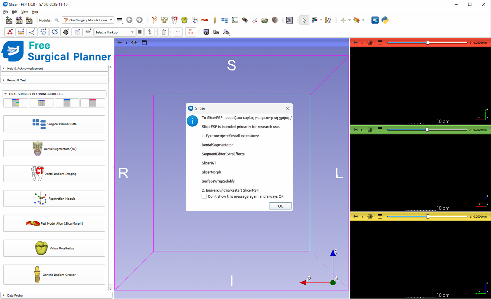

Slicer‑FSP — Free Surgical Planner

https://doi.org/10.5281/zenodo.18596636

Overview

Slicer‑FSP (Free Surgical Planner) is an open‑source, fully integrated workflow for oral and maxillofacial surgery planning.
It provides a unified environment for:

CBCT and intraoral scan preparation

AI‑based dental segmentation

Registration and alignment

Implant planning

Virtual prosthetic design

Surgical data export

The project is built on 3D Slicer and includes custom modules, modified Slicer source files, and a packaged executable for immediate use.

Option A — Download the Executable (Recommended)

👉 <b>Download Slicer‑FSP v1.0.1 (github.com)</b>

This version includes:

All required Python packages

Custom UI and branding

All Slicer‑FSP modules pre‑installed

Modified Slicer source files

Automatic extension installation prompt

Option B — Manual Installation (Advanced Users)

1. Install 3D Slicer
Install the latest stable version of 3D Slicer from:
https://www.slicer.org/

2. Install required Slicer extensions
   
DentalSegmentator

SegmentEditorExtraEffects

SlicerIGT

SlicerMorph

SurfaceWrapSolidify

3. Install Python dependencies
 
Slicer‑FSP requires two additional Python packages:

pyacvd

fpdf

Install them inside Slicer’s Python environment:

python
slicer.util.pip_install("pyacvd")
slicer.util.pip_install("fpdf")

4. Add Slicer‑FSP modules
Copy the modules from the Modules/ folder into your Slicer modules directory.

5. Apply modified Slicer source files (optional)
Only required if building a custom Slicer‑FSP executable.

6. Restart Slicer

Application Layout

<h3 align="center">Startup Layout</h3>

Video Tutorials

YouTube Channel
https://www.youtube.com/@opensourceguided4719 (youtube.com)

Tutorial Website
https://freesurgplan.edu.gr/ (freesurgplan.edu.gr)

Modules Included

OralSurgModuleHome

DentImplImaging

RegisterModule

ModelAlignment

VirtualProsth

GenericImplCreator

Additional helper modules

Modified Slicer Source

The repository includes a folder with modified Slicer source files used to build the custom Slicer‑FSP executable.

Citation

If you use Slicer‑FSP in academic work, please cite:

Code

D. T., Slicer‑FSP: Free Surgical Planner, 2026.

DOI: https://doi.org/10.5281/zenodo.18596636

This DOI is the Concept DOI, which always points to the latest version of the software.

License

This project is released under the Apache 2.0 License, consistent with 3D Slicer.

Slicer‑FSP — Ελεύθερος Χειρουργικός Σχεδιασμός

https://doi.org/10.5281/zenodo.18596636

Επισκόπηση

Το Slicer‑FSP (Free Surgical Planner) είναι ένα ανοιχτού κώδικα, πλήρως ολοκληρωμένο περιβάλλον για τον σχεδιασμό στοματικής και γναθοπροσωπικής χειρουργικής και εμφυτευμάτων.
Προσφέρει ενιαίο workflow για:

Προετοιμασία CBCT και ενδοστοματικών σαρώσεων

Αυτόματη τμηματοποίηση δοντιών με AI

Registration και ευθυγράμμιση

Σχεδιασμό εμφυτευμάτων

Εικονική προσθετική

Εξαγωγή χειρουργικών δεδομένων

Επιλογή Α — Λήψη Εκτελέσιμου (Συνιστάται)

👉 <b>Λήψη Slicer‑FSP v1.0.1 (github.com)</b>

Περιλαμβάνει:

Όλα τα απαραίτητα Python packages

Προσαρμοσμένο UI και branding

Όλα τα modules του Slicer‑FSP

Τροποποιημένα αρχεία Slicer

Αυτόματη εγκατάσταση extensions

Επιλογή Β — Χειροκίνητη Εγκατάσταση (Για προχωρημένους)

1. Εγκατάσταση 3D Slicer

Εγκαταστήστε την τελευταία σταθερή έκδοση του 3D Slicer από:
https://www.slicer.org/

2. Εγκατάσταση των extensions

DentalSegmentator

SegmentEditorExtraEffects

SlicerIGT

SlicerMorph

SurfaceWrapSolidify

3. Python dependencies

Απαιτούνται δύο επιπλέον Python packages:

pyacvd

fpdf

Εγκατάσταση μέσα από το Python Interactor του Slicer:

python
slicer.util.pip_install("pyacvd")
slicer.util.pip_install("fpdf")

4. Προσθήκη των modules του Slicer‑FSP
Αντιγράψτε τα modules από τον φάκελο Modules/ στον φάκελο modules του Slicer.

5. Εφαρμογή τροποποιημένων αρχείων Slicer (προαιρετικό)
Απαιτείται μόνο για δημιουργία custom εκτελέσιμου.

6. Επανεκκίνηση του Slicer

Layout Εφαρμογής
<h3 align="center">Αρχικό Layout</h3>

Βίντεο Οδηγιών

YouTube Channel
https://www.youtube.com/@opensourceguided4719 (youtube.com)

Ιστότοπος Εκπαιδευτικού Υλικού
https://freesurgplan.edu.gr/ (freesurgplan.edu.gr)

Περιεχόμενα Modules

OralSurgModuleHome

DentImplImaging

RegisterModule

ModelAlignment

VirtualProsth

GenericImplCreator

Επιπλέον βοηθητικά modules

Τροποποιημένος Κώδικας Slicer

Το repository περιλαμβάνει φάκελο με τροποποιημένα αρχεία πηγαίου κώδικα του Slicer που χρησιμοποιήθηκαν για την κατασκευή του custom εκτελέσιμου Slicer‑FSP.

Αναφορά

Αν χρησιμοποιήσετε το Slicer‑FSP σε επιστημονική εργασία, παρακαλώ αναφέρετε:

Code
D. T., Slicer‑FSP: Ελεύθερος Χειρουργικός Σχεδιασμός, 2026.

DOI: https://doi.org/10.5281/zenodo.18596636

Το DOI αυτό είναι το Concept DOI, το οποίο παραμένει σταθερό και οδηγεί πάντα στην τελευταία έκδοση του λογισμικού.

Άδεια Χρήσης

Το έργο διατίθεται υπό την Apache 2.0 License, όπως και το 3D Slicer.
